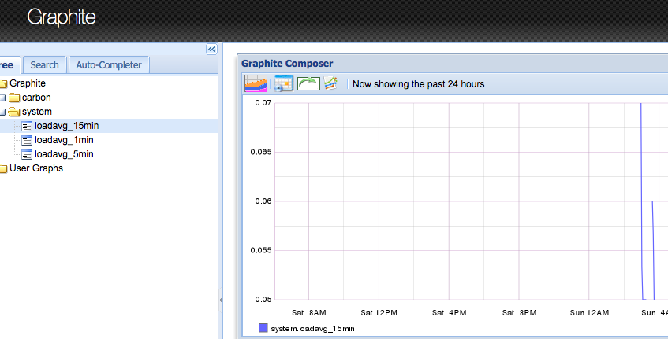
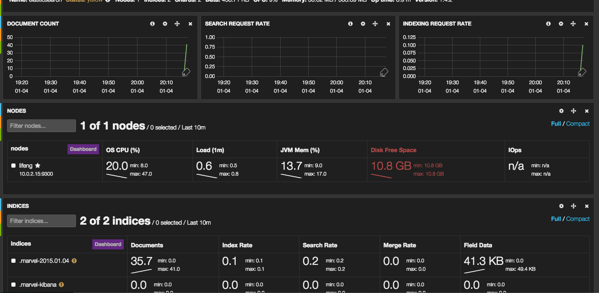
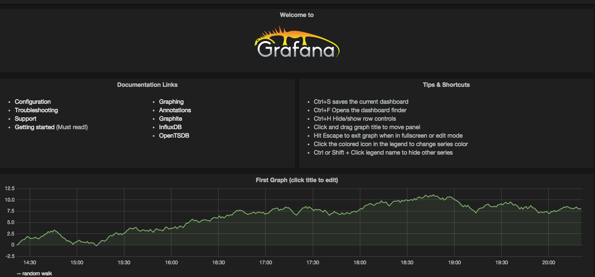
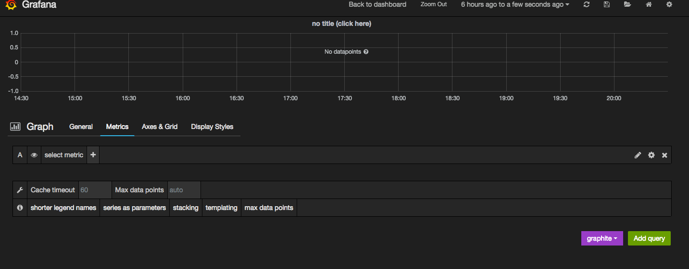
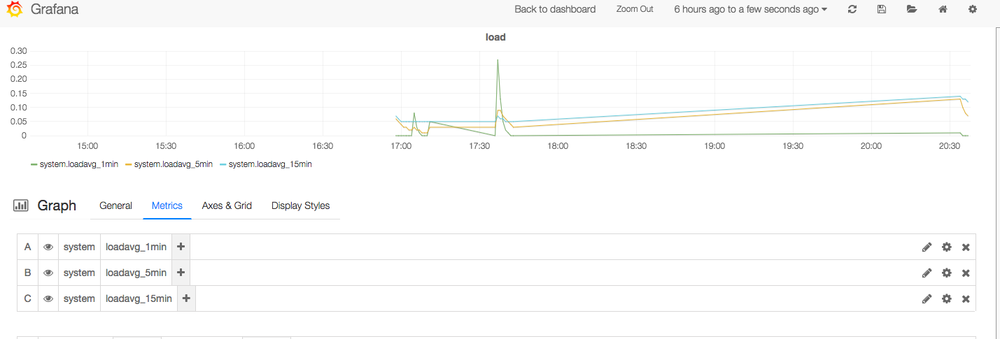

sherlock (Know your code better)
========

code-level monitor platform

#### Open source used
* [graphite](http://graphite.wikidot.com/) Scalable Realtime Graphing
* [grafana](http://grafana.org/) graphite dashboard. __graphite web is so odd__
* [elasticsearch](http://www.elasticsearch.org/) realtime distribute search

#### Install process

##### graphite install [reference](http://www.vpsee.com/2012/05/install-graphite-on-ubuntu-12-04/)
* install necessary tools
 
 		sudo apt-get install apache2 libapache2-mod-wsgi python-django python-twisted python-cairo python-pip python-django-tagging`
* pip install tools related

		sudo pip install whisper,carbon,graphite-web
		
* copy default conf

		$ cd /opt/graphite/conf/
        $ sudo cp carbon.conf.example carbon.conf
        $ sudo cp storage-schemas.conf.example storage-schemas.conf
        $ sudo cp graphite.wsgi.example graphite.wsgi
* modify apache conf

        wget http://launchpad.net/graphite/0.9/0.9.9/+download/graphite-web-0.9.9.tar.gz
        $ tar -zxvf graphite-web-0.9.9.tar.gz
        $ cd graphite-web-0.9.9
        $ sudo cp examples/example-graphite-vhost.conf /etc/apache2/sites-available/default

* modify sockets path

		$ sudo vi /etc/apache2/sites-available/default
        WSGISocketPrefix /var/run/apache2/wsgi
        
* modify graphite database 

		cd /opt/graphite/webapp/graphite/
		$ sudo python manage.py syncdb
		$ sudo chown -R www-data:www-data /opt/graphite/storage/
		$ sudo cp local_settings.py.example local_settings.py
		$ sudo /etc/init.d/apache2 restart
		$ sudo /etc/init.d/apache2 reload	
	
* start carbon

		$ cd /opt/graphite/
		$ sudo ./bin/carbon-cache.py start
		
input ip in your browser and see the page like:

##### elasticsearct install
* download and tar

		cd elasticsearch-1.4.2 
		bin/elasticsearch -Xmx512m -Xms512m -Des.index.store.type=memory --node.name=*
		
> Exception in thread "main" java.lang.UnsupportedClassVersionError: org/elasticsearch/bootstrap/Elasticsearch : Unsupported major.minor version 51.0
> 
> please note:  __need jdk 1.7 or upper__

* elastic has monitor dashboard, but only for develop free

		bin/plugin -i elasticsearch/marvel/latest
		
* input http://your elastic server ip/_plugin/marvel/

##### grafana install
* download grafana
* cp under the directory of apache vhost conf document
* modify config.js
		
		mv config.sample.js config.js, 
		vim config.js and modify as below
		datasources: {
          graphite: {
          type: 'graphite',
          url: "http://my.graphite.server.com:8080",
        },
        elasticsearch: {
          type: 'elasticsearch',
          url: "http://my.elastic.server.com:9200",
          index: 'grafana-dash',
          grafanaDB: true,
          }
        },
Result as :

##### display system data
* graphite python example, it create 1 5 15 minute load use

	python example-clent.py
	
* operate on grafana page, click add panel graph and edit, result as below

		
		You can see graphite datasource
		
* add system source and display 1 5 15 minute averge load data, result as below

#### TODO

* [Influxdb](http://influxdb.com/) other distribute time series database, can instead graphite
* [metrics](https://dropwizard.github.io/metrics/3.1.0/getting-started/) java metrics lib,use this to monitor your code runtime metrics like count, time and latency ,use this lib to export jersy api metrics to graphite and display metrics related (accomplish jersy console report metrics at 2015-01-06, next report data import to graphite)
